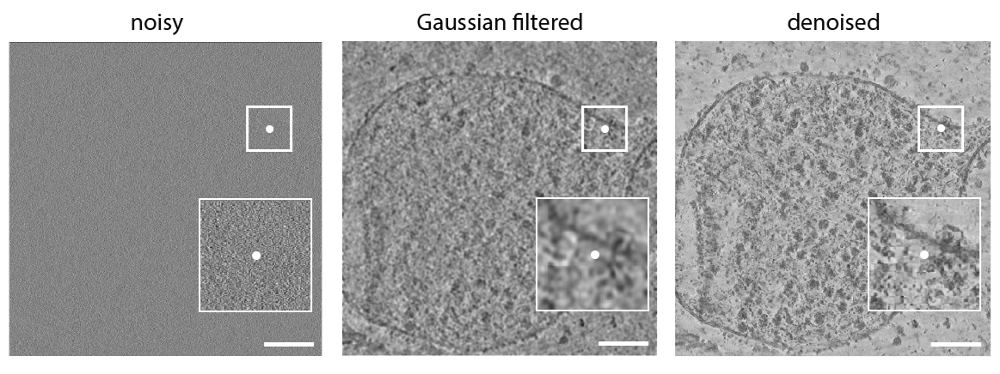

# Denoising

The denoising module reduces noise in tomograms while preserving structural detail. It’s typically the **first step**
before semantic/instance segmentation or particle identification. For best performance, it's recommended to have a **WBP
reconstructed tomogram**, since the denoising model was trained on WBP simulated tomograms.



- **Left:** Raw WBP noisy tomogram
- **Middle:** Gaussian filtered tomogram
- **Right:** CryoSiam denoised tomogram

---

## Trained Model

You can download the trained model from
here: [CryoSiam denoising model (v1.0)](https://huggingface.co/frosinastojanovska/cryosiam_v1.0/blob/main/cryosiam_denoising.ckpt)

---

## :octicons-command-palette-16: Command

Run denoising via the CLI using a YAML configuration file:

```bash
cryosiam denoise --config_file=configs/config_denoising.yaml
```

**What it does**

- Loads the trained denoising model and your tomogram/s
- Applies sliding‑window 3D inference (GPU/CPU)
- Writes denoised volumes to the output folder (and optional intermediates)

---

## Example Configuration File

:octicons-download-16: [Download example config](configs/config_denoising.yaml)

```yaml
data_folder: '/scratch/stojanov/datatset1/tomograms'
log_dir: '/scratch/stojanov/datatset1/'
prediction_folder: '/scratch/stojanov/datatset1/predictions/denoised'

trained_model: '/scratch/stojanov/trained_models/cryosiam_denoising.ckpt'
file_extension: '.mrc'

test_files: null

save_raw_predictions: False
scale_prediction: True

parameters:
  gpu_devices: 1
  data:
    patch_size: [ 128, 128, 128 ]
    min: 0
    max: 1
    mean: 0
    std: 1
  network:
    in_channels: 1
    spatial_dims: 3

hyper_parameters:
  batch_size: 3
```

---

## Config Reference

### Top‑level keys

| Key                    | Type                  | Must change the default value | Description                                                                                  |
|------------------------|-----------------------|------------------------------:|----------------------------------------------------------------------------------------------|
| `data_folder`          | `str`                 |                             ✅ | Directory containing input tomograms to denoise.                                             |
| `log_dir`              | `str`                 |                             ✅ | Folder where logs (runtime, metrics, debug files) are written.                               |
| `prediction_folder`    | `str`                 |                             ✅ | Output directory where denoised tomograms (and optional intermediates) are saved.            |
| `trained_model`        | `str`                 |                             ✅ | Path to the denoising trained model checkpoint file (e.g., `.ckpt`).                         |
| `file_extension`       | `str`                 |                             ❌ | Extension of input tomograms (`.mrc` or `.rec`). Default is `.mrc`.                          |
| `test_files`           | `list[str]` or `null` |                             ❌ | List of specific filenames to process. Use `null` to process **all** files in `data_folder`. |
| `save_raw_predictions` | `bool`                |                             ❌ | If `true`, also save the raw .h5 file/s.                                                     |
| `scale_prediction`     | `bool`                |                             ❌ | If `true`, rescale/restore prediction to intensity 0 to 1.                                   |

---

### `parameters`

| Key                    | Type                 | Must change the default value | Description                                                                                                                                          |
|------------------------|----------------------|------------------------------:|------------------------------------------------------------------------------------------------------------------------------------------------------|
| `gpu_devices`          | `int` or `list[int]` |                             ❌ | Is there a GPU(s) to use. Example: `1` or `[0]`. Set to `[0]` to force CPU inference (not recommended).                                              |
| `data.patch_size`      | `list[int]`          |                             ❌ | 3D sliding‑window patch size, e.g., `[128,128,128]`. Reduce if you hit GPU OOM error, otherwise the default is what was use for training the models. |
| `data.min`             | `float`              |                             ❌ | Intensity floor applied before normalization/clipping.                                                                                               |
| `data.max`             | `float`              |                             ❌ | Intensity ceiling applied before normalization/clipping.                                                                                             |
| `data.mean`            | `float`              |                             ❌ | Mean used for normalization (match training stats if model expects it).                                                                              |
| `data.std`             | `float`              |                             ❌ | Std used for normalization (match training stats if model expects it).                                                                               |
| `network.in_channels`  | `int`                |                             ❌ | Number of input channels (typically `1` for tomograms).                                                                                              |
| `network.spatial_dims` | `int`                |                             ❌ | Dimensionality of the model (use `3` for 3D tomograms).                                                                                              |

> **Tips**  
> • Keep `patch_size` the same value as used in the trained network (e.g., the available trained networks are with patch
> size 128).

---

### `hyper_parameters`

| Key          | Type  | Must change the default value | Description                                                                                            |
|--------------|-------|------------------------------:|--------------------------------------------------------------------------------------------------------|
| `batch_size` | `int` |                             ❌ | Number of 3D patches per forward pass. Increase for throughput; decrease if you hit GPU memory limits. |

---

## Outputs

- **Denoised tomograms** written to `prediction_folder` (file extension as implemented).
- **Optional raw outputs** if `save_raw_predictions: true`.
- **Logs** saved under `log_dir` (progress, timings, optional debug artifacts).

**Naming:** outputs follow the input basenames with an appropriate suffix/extension as implemented in CryoSiam.

---

## Troubleshooting

| Symptom                     | Suggested Fix                                                                                                             |
|-----------------------------|---------------------------------------------------------------------------------------------------------------------------|
| `CUDA out of memory`        | Lower `hyper_parameters.batch_size` and/or `parameters.data.patch_size`; ensure no other heavy GPU processes are running. |
| No files processed          | Ensure `data_folder` exists and `test_files` is `null` or matches filenames exactly.                                      |
| Output intensities look off | Toggle `scale_prediction`; adjust `data.min/max` or remove custom `mean/std` to match training normalization.             |
| Checkpoint/shape mismatch   | Verify `network.in_channels` and `spatial_dims` match the trained model; confirm you’re using the correct `.ckpt`.        |

---

## Next Steps

- Continue
  with [Semantic segmentation](semantic.md), [Semantic segmentation training](semantic_training.md), [Instance segmentation](instance.md)
  or [Particle identification](particle_identification.md)
- Review the [Usage overview](usage.md) for full pipelines
