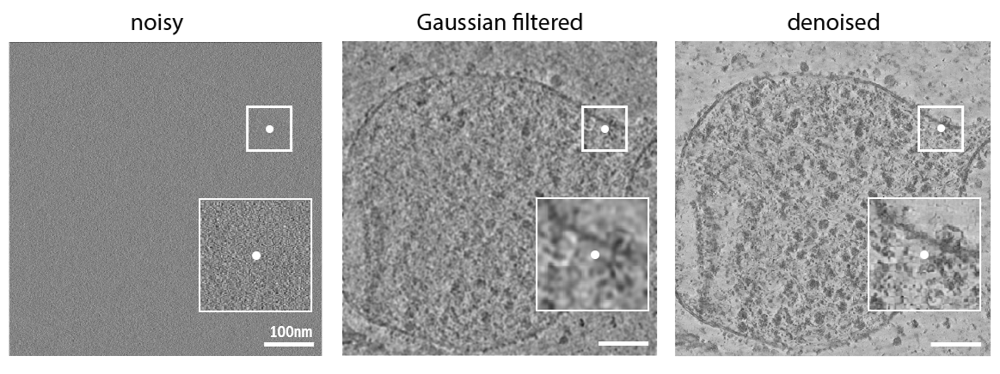

# Denoising

The denoising module reduces noise in cryo-electron tomograms while preserving structural detail.
It is typically the first step in a CryoSiam pipeline, preceding semantic segmentation, instance segmentation, or
particle identification.

For best performance, it is recommended to use **WBP-reconstructed tomograms**, as the denoising model was trained on
simulated WBP data.



- **Left:** Raw WBP noisy tomogram
- **Middle:** Gaussian filtered tomogram
- **Right:** CryoSiam denoised tomogram

---

## Trained Model

A pre-trained denoising model is provided and can be downloaded from:

[CryoSiam denoising model (v1.0)](https://huggingface.co/frosinastojanovska/cryosiam_v1.0/blob/main/cryosiam_denoising.ckpt)

---

## :octicons-command-palette-16: Running denoising

Denoising is performed via the command-line interface using a YAML configuration file:

```bash
cryosiam denoise_predict --config_file=configs/config_denoising.yaml
```

**What this command does**

- Loads the trained denoising model and the input tomogram(s)
- Applies sliding-window 3D inference (GPU)
- Writes denoised tomograms to the specified output directory
- Optionally saves intermediate or raw prediction files

**Visualization**
Denoised outputs can be visualized using CryoSiam-Vis.
See the visualization instructions [here](visualization.md#visualize_denoising).

---

## Example Configuration File

:octicons-download-16: [Download example config](configs/config_denoising.yaml)

```yaml
data_folder: '/scratch/stojanov/dataset1/tomograms'
prediction_folder: '/scratch/stojanov/dataset1/predictions/denoised'

trained_model: '/scratch/stojanov/trained_models/cryosiam_denoising.ckpt'
file_extension: '.mrc'

test_files: null

save_raw_predictions: False
scale_prediction: True

parameters:
  data:
    patch_size: [ 128, 128, 128 ]
    min: 0
    max: 1
    mean: 0
    std: 1
  network:
    in_channels: 1
    spatial_dims: 3

hyper_parameters:
  batch_size: 3
```

---

## Config Reference

### Top‑level keys

| Key                    | Type                  | Must change the default value | Description                                                                                 |
|------------------------|-----------------------|------------------------------:|---------------------------------------------------------------------------------------------|
| `data_folder`          | `str`                 |                             ✅ | Directory containing input tomograms to denoise                                             |
| `prediction_folder`    | `str`                 |                             ✅ | Output directory for denoised tomograms                                                     |
| `trained_model`        | `str`                 |                             ✅ | Path to the trained denoising model checkpoint (`.ckpt`)                                    |
| `file_extension`       | `str`                 |                             ❌ | Input file extension (`.mrc` or `.rec`, default: `.mrc`)                                    |
| `test_files`           | `list[str]` or `null` |                             ❌ | List of specific filenames to process. Use `null` to process **all** files in `data_folder` |
| `save_raw_predictions` | `bool`                |                             ❌ | Save raw prediction files (.h5) in addition to final outputs                                |
| `scale_prediction`     | `bool`                |                             ❌ | Rescale output intensities to [0, 1]                                                        |

---

### `parameters`

| Key                    | Type        | Must change the default value | Description                                     |
|------------------------|-------------|------------------------------:|-------------------------------------------------|
| `data.patch_size`      | `list[int]` |                             ❌ | Sliding-window patch size for 3D inference      |
| `data.min`             | `float`     |                             ❌ | Intensity minimum value for data scaling        |
| `data.max`             | `float`     |                             ❌ | Intensity maximum value for data scaling        |
| `data.mean`            | `float`     |                             ❌ | Mean used for normalization                     |
| `data.std`             | `float`     |                             ❌ | Std used for normalization                      |
| `network.in_channels`  | `int`       |                             ❌ | Number of input channels (usually `1`)          |
| `network.spatial_dims` | `int`       |                             ❌ | Dimensionality of the model (`3` for tomograms) |

> **Tips**  
> Keep `patch_size` consistent with the value used during training (e.g. 128³ for the provided model). Reduce it only if
> you encounter GPU memory issues.

---

### `hyper_parameters`

| Key          | Type  | Must change the default value | Description                                      |
|--------------|-------|------------------------------:|--------------------------------------------------|
| `batch_size` | `int` |                             ❌ | Number of 3D patches processed per forward pass. |

---

## Outputs

The denoising step produces:

- **Denoised tomograms** saved to `prediction_folder` (file extension as implemented).
- **Optional raw prediction files** if `save_raw_predictions: true`.

Output filenames follow the input basenames with appropriate suffixes.

---

## Troubleshooting

| Symptom                     | Suggested Fix                                                                             |
|-----------------------------|-------------------------------------------------------------------------------------------|
| `CUDA out of memory`        | Reduce `batch_size` and/or `patch_size`; ensure no other heavy GPU processes are running. |
| No files processed          | Ensure `data_folder` exists and `test_files` is `null` or matches filenames exactly.      |
| Output intensities look off | Toggle `scale_prediction`.                                                                |
| Model/shape mismatch        | Verify `in_channels` and `spatial_dims` and the correct `.ckpt` file are used.            |

---

## Next Steps

After denoising, continue with:

- [Semantic segmentation](semantic.md)
- [Semantic segmentation training](semantic_training.md)
- [Instance segmentation](instance.md)
- [Particle identification](particle_identification.md)

For an overview of complete pipelines, see the[Usage overview](usage.md).
