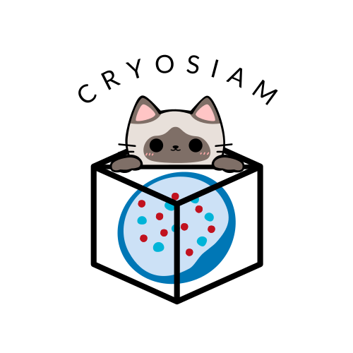

# CryoSiam Documentation

  

Welcome to the official documentation for the CryoSiam method. This guide will help to use this tool effectively.

CryoSiam is a self-supervised deep learning framework that works on dense and subtomogram levels. The dense part of the framework is additionally trained on subtasks for tomogram denoising, semantic segmentation (particle identification) and instance segmentation. The subtomogram level part of the method offers embedding representation of the detected particles in the tomogram/s. 

For details, please refer to the [CryoSiam preprint](https://www.biorxiv.org/content/10.1101/2025.11.11.687379).

[Installation →](installation.md)

[Usage →](usage.md)

[Tutorial →](tutorial.md)