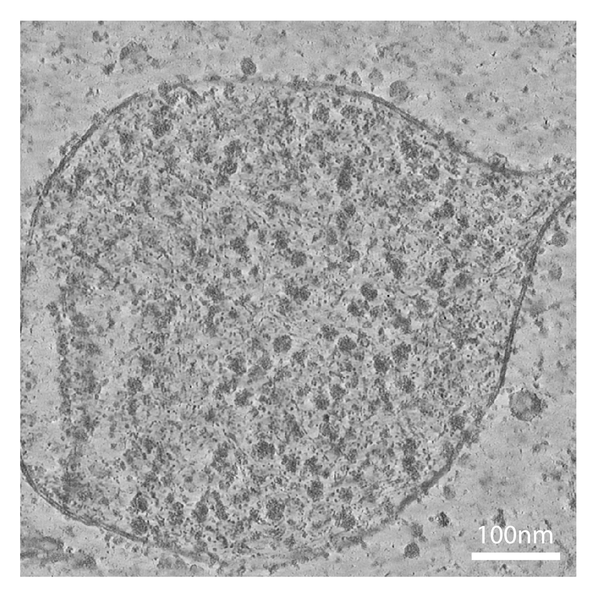
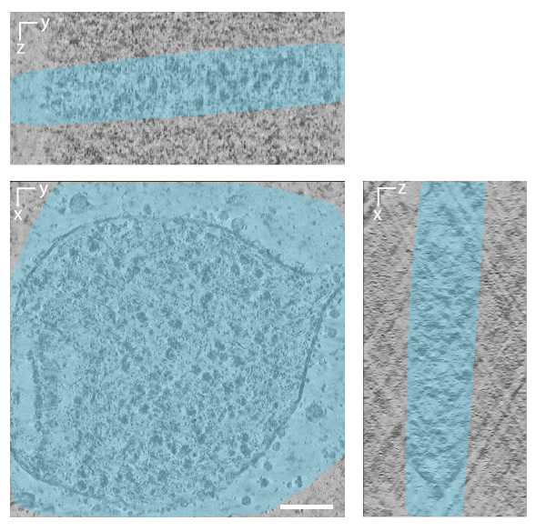

# Semantic Segmentation

The semantic segmentation module classifies each voxel of a tomogram into biologically meaningful categories (e.g.
membranes, particles, filaments (DNA/RNA), microtubules, actin).  
It also offers **lamella prediction** as a sub-step to restrict analysis to lamella regions, which is **highly
recommended** to avoid false positives outside the lamella (since models were not trained on the noisy surrounding
volume).

---

## Two Abilities

1. **Lamella Prediction**
    - Identifies lamella (sample) region.
    - Recommended to remove false positives outside the lamella.
    - Produces binary masks and probability maps.

2. **Voxel-wise Semantic Segmentation**
    - Classifies voxels inside the lamella into biological classes.
    - Works best when restricted to lamella.

**Recommended workflow:**  
`Denoising → Lamella Prediction → Semantic Segmentation`

---

## Example Results

- **Lamella mask**: restricts analysis to lamella regions
- **Semantic segmentation**: predicted structures inside lamella

### Input (Denoised Tomogram)

{ width="300" }

### Lamella Prediction

{ width="400" }

### Semantic Segmentation

{ width="800" }


---

## Trained Models

You can download the trained lamella model from here: [CryoSiam lamella model (v1.0)](...), and the semantic
segmentation model from here: [CryoSiam semantic model (v1.0)](...).
You can also train your own model and then perform prediction with that model. Review
the [Semantic training](semantic_training.md) for explanation of the model training procedure.

___

## :octicons-command-palette-16: Command

Run lamella prediction via the CLI using a YAML configuration file:

```bash
cryosiam semantic_predict --config_file=configs/config_lamella.yaml
```

**What it does**

- Loads the trained lamella model and your denoised tomogram/s
- Applies sliding‑window 3D inference (GPU/CPU)
- Writes semantic segmentation predictions to the output folder (and optional intermediates)

Run semantic segmentation via the CLI using a YAML configuration file:

```bash
cryosiam semantic_predict --config_file=configs/config_semantic.yaml
```

**What it does**

- Loads the trained semantic model and your denoised tomogram/s and lamella prediction/s
- Applies sliding‑window 3D inference (GPU/CPU)
- Writes semantic segmentation predictions to the output folder (and optional intermediates)

---

## Example Configurations

CryoSiam semantic segmentation is usually run in **two stages**.

---

### 1. Lamella Prediction (`configs/config_lamella.yaml`)

📥 [Download lamella config](configs/config_lamella.yaml)

```yaml
data_folder: '/scratch/stojanov/datatset1/predictions/denoised'
log_dir: '/scratch/stojanov/datatset1/'
prediction_folder: '/scratch/stojanov/datatset1/predictions/lamella'

trained_model: '/scratch/stojanov/trained_models/cryosiam_lamella.ckpt'
file_extension: '.mrc'

test_files: null

save_internal_files: False

parameters:
  gpu_devices: 1
  data:
    patch_size: [ 128, 128, 128 ]
    min: 0
    max: 1
    mean: 0
    std: 1
  network:
    in_channels: 1
    spatial_dims: 3
    threshold: 0.9
    postprocessing: True
    3d_postprocessing: False

hyper_parameters:
  batch_size: 2
```

### Config Reference

#### Top‑level keys

| Key                   | Type                  | Must change the default value | Description                                                           |
|-----------------------|-----------------------|------------------------------:|-----------------------------------------------------------------------|
| `data_folder`         | `str`                 |                             ✅ | Directory containing **denoised** tomograms to predict lamella from.  |
| `log_dir`             | `str`                 |                             ✅ | Folder where logs (runtime, metrics, debug files) are written.        |
| `prediction_folder`   | `str`                 |                             ✅ | Directory where lamella masks (and optional intermediates) are saved. |
| `trained_model`       | `str`                 |                             ✅ | Path to the lamella trained model checkpoint file (e.g., `.ckpt`).    |
| `file_extension`      | `str`                 |                             ❌ | Extension of input tomograms (`.mrc` or `.rec`). Default is `.mrc`.   |
| `test_files`          | `list[str]` or `null` |                             ❌ | Specific tomograms to process. `null` = process all.                  |
| `save_internal_files` | `bool`                |                             ❌ | Save intermediate files (prob maps, debug info).                      |

---

#### `parameters`

| Key                         | Type                 | Must change the default value | Description                                                                                                                                          |
|-----------------------------|----------------------|------------------------------:|------------------------------------------------------------------------------------------------------------------------------------------------------|
| `gpu_devices`               | `int` or `list[int]` |                             ❌ | Is there a GPU(s) to use. Example: `1` or `[0]`. Set to `[0]` to force CPU inference (not recommended).                                              |
| `data.patch_size`           | `list[int]`          |                             ❌ | 3D sliding‑window patch size, e.g., `[128,128,128]`. Reduce if you hit GPU OOM error, otherwise the default is what was use for training the models. |
| `data.min`                  | `float`              |                             ❌ | Intensity floor applied before normalization/clipping.                                                                                               |
| `data.max`                  | `float`              |                             ❌ | Intensity ceiling applied before normalization/clipping.                                                                                             |
| `data.mean`                 | `float`              |                             ❌ | Mean used for normalization (match training stats if model expects it).                                                                              |
| `data.std`                  | `float`              |                             ❌ | Std used for normalization (match training stats if model expects it).                                                                               |
| `network.in_channels`       | `int`                |                             ❌ | Number of input channels (typically `1` for tomograms).                                                                                              |
| `network.spatial_dims`      | `int`                |                             ❌ | Dimensionality of the model (use `3` for 3D tomograms).                                                                                              |
| `network.threshold`         | `float`              |                             ✅ | Probability cutoff to binarize lamella mask. Default `0.9`.                                                                                          |
| `network.postprocessing`    | `bool`               |                             ❌ | Apply morphological postprocessing for cleanup (recommended).                                                                                        |
| `network.3d_postprocessing` | `bool`               |                             ❌ | Apply the postprocessing in 3D.                                                                                                                      |

> **Tips**  
> • Set `threshold` lower (e.g., 0.7) if lamella masks are too strict.  
> • Always run with `postprocessing: True` for cleaner masks.

---

#### `hyper_parameters`

| Key          | Type  | Must change the default value | Description                                                                                            |
|--------------|-------|------------------------------:|--------------------------------------------------------------------------------------------------------|
| `batch_size` | `int` |                             ❌ | Number of 3D patches per forward pass. Increase for throughput; decrease if you hit GPU memory limits. |

---

### 2. Semantic Segmentation (`configs/config_semantic.yaml`)

📥 [Download semantic config](configs/config_semantic.yaml)

```yaml
data_folder: '/scratch/stojanov/datatset1/predictions/denoised'
mask_folder: '/scratch/stojanov/datatset1/predictions/lamella'
log_dir: '/scratch/stojanov/datatset1/'
prediction_folder: '/scratch/stojanov/datatset1/predictions/semantic'

trained_model: '/scratch/stojanov/trained_models/cryosiam_semantic.ckpt'
file_extension: '.mrc'

test_files: null

parameters:
  gpu_devices: 1
  data:
    patch_size: [ 128, 128, 128 ]
    min: 0
    max: 1
    mean: 0
    std: 1
  network:
    in_channels: 1
    spatial_dims: 3
    threshold: 0.1
    postprocessing_sizes: [ -1, 5000, -1, -1, -1 ]

hyper_parameters:
  batch_size: 2
```

### Config Reference

#### Top‑level keys

| Key                 | Type                  | Must change the default value | Description                                                              |
|---------------------|-----------------------|------------------------------:|--------------------------------------------------------------------------|
| `data_folder`       | `str`                 |                             ✅ | Directory containing **denoised** tomograms.                             |
| `mask_folder`       | `str`                 |                             ✅ | Directory containing predicted lamella masks (from step 1).              |
| `log_dir`           | `str`                 |                             ✅ | Folder where logs are written.                                           |
| `prediction_folder` | `str`                 |                             ✅ | Directory where prediction masks (and optional intermediates) are saved. |
| `trained_model`     | `str`                 |                             ✅ | Path to the semantic checkpoint file (e.g., `.ckpt`).                    |
| `file_extension`    | `str`                 |                             ❌ | Extension of input tomograms (`.mrc` or `.rec`). Default is `.mrc`.      |
| `test_files`        | `list[str]` or `null` |                             ❌ | Specific tomograms to process. `null` = process all.                     |

---

#### `parameters`

| Key                            | Type                 | Must change the default value | Description                                                                                                                                                   |
|--------------------------------|----------------------|------------------------------:|---------------------------------------------------------------------------------------------------------------------------------------------------------------|
| `gpu_devices`                  | `int` or `list[int]` |                             ❌ | Is there a GPU(s) to use. Example: `1` or `[0]`. Set to `[0]` to force CPU inference (not recommended).                                                       |
| `data.patch_size`              | `list[int]`          |                             ❌ | 3D sliding‑window patch size, e.g., `[128,128,128]`. Reduce if you hit GPU OOM error, otherwise the default is what was use for training the models.          |
| `data.min`                     | `float`              |                             ❌ | Intensity floor applied before normalization/clipping.                                                                                                        |
| `data.max`                     | `float`              |                             ❌ | Intensity ceiling applied before normalization/clipping.                                                                                                      |
| `data.mean`                    | `float`              |                             ❌ | Mean used for normalization (match training stats if model expects it).                                                                                       |
| `data.std`                     | `float`              |                             ❌ | Std used for normalization (match training stats if model expects it).                                                                                        |
| `network.in_channels`          | `int`                |                             ❌ | Number of input channels (typically `1` for tomograms).                                                                                                       |
| `network.spatial_dims`         | `int`                |                             ❌ | Dimensionality of the model (use `3` for 3D tomograms).                                                                                                       |
| `network.threshold`            | `float`              |                             ❌ | Probability cutoff to clean very small probability predictions. Default `0.1`.                                                                                |
| `network.postprocessing_sizes` | `list[int]`          |                             ✅ | Postprocessing thresholds for the size of connected components. Example: `[ -1, 5000, -1, -1, -1 ]` keeps only connected components >5000 voxels for label 2. |

> **Tips**  
> • Tune `postprocessing_sizes` depending on dataset type and noise in predictions.

---

#### `hyper_parameters`

| Key          | Type  | Must change the default value | Description                                                                                            |
|--------------|-------|------------------------------:|--------------------------------------------------------------------------------------------------------|
| `batch_size` | `int` |                             ❌ | Number of 3D patches per forward pass. Increase for throughput; decrease if you hit GPU memory limits. |

---

## Outputs

- **Lamella mask** written to `prediction_folder` (file extension is .h5).
- **Segmentation mask** written to `prediction_folder` (file extension is .h5).
- **Optional raw outputs** if `save_raw_predictions: true`.
- **Logs** saved under `log_dir` (progress, timings, optional debug artifacts).

**Naming:** outputs follow the input basenames with an appropriate suffix/extension as implemented in CryoSiam.

---

## Troubleshooting

| Symptom                         | Suggested Fix                                                        |
|---------------------------------|----------------------------------------------------------------------|
| False positives outside lamella | Ensure lamella prediction is run and `mask_folder` is set correctly. |
| CUDA OOM                        | Lower `batch_size` or patch size.                                    |
| Blank segmentation              | Check `trained_model` path and lower thresholds.                     |

---

## Next Steps

- Continue with [Semantic segmentation training](semantic_training.md), [Instance segmentation](instance.md)
  or [Particle identification](particle_identification.md)
- Review the [Usage overview](usage.md) for full pipelines