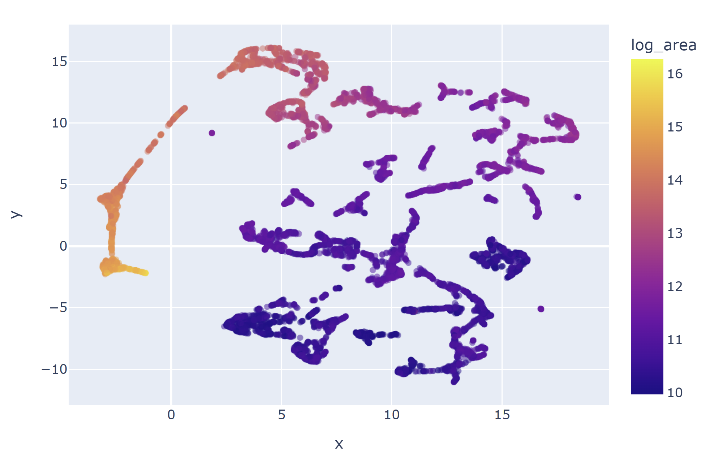

# Subtomogram Embeddings Generation

The Subtomogram Embeddings task extracts fixed-length feature representations from segmented subtomograms.  
These embeddings capture the 3D structural and textural properties of each instance and enable unsupervised comparison, visualization, and clustering.

> **Workflow:** `Instance Segmentation → Subtomogram Embeddings → Visualization → (Optional Clustering)`  
> Embeddings are generated from **instance masks** produced in the previous step.

---

## Example Results

- **UMAP visualization:** Each point represents a subtomogram embedding.
- **KMeans clusters:** Distinct color-coded groups of similar structural features.
- **Spectral clusters:** Captures fine-grained structural variability.

### Embedding Space Projection

{ width="400" }

### KMeans Clustering

{ width="400" }

### Spectral Clustering

{ width="400" }

---

## Trained Model

You can download the trained model from
here: [CryoSiam subtomogram embedding model (v1.0)](https://huggingface.co/frosinastojanovska/cryosiam_v1.0/blob/main/simsiam_embeds_denoised_convex_hull.ckpt)

---

## :octicons-command-palette-16: Commands

### Generate Embeddings

```bash
cryosiam simsiam_embeddings_predict --config_file=configs/subtomo_embeddings.yaml
```

Optionally, process a single tomogram:

```bash
cryosiam simsiam_embeddings_predict --config_file=configs/subtomo_embeddings.yaml --filename TS_01.mrc
```

---

### Visualize Embeddings

```bash
cryosiam simsiam_visualize_embeddings --config_file=configs/subtomo_embeddings.yaml
```

This command generates UMAP/PCA projections and distance maps for qualitative inspection.

---

### (Optional) Cluster Embeddings

**KMeans clustering:**

```bash
cryosiam simsiam_embeddings_kmeans_clustering --config_file=configs/subtomo_embeddings.yaml
```

**Spectral clustering:**

```bash
cryosiam simsiam_embeddings_spectral_clustering --config_file=configs/subtomo_embeddings.yaml
```

---

## Example Configuration (`configs/config_subtomo_embeddings.yaml`)

:octicons-download-16: [Download example config](configs/config_subtomo_embeddings.yaml)

```yaml
data_folder: '/scratch/stojanov/dataset1/predictions/denoised'
instances_mask_folder: '/scratch/stojanov/dataset1/predictions/instances'
log_dir: '/scratch/stojanov/dataset1/'
prediction_folder: '/scratch/stojanov/dataset1/predictions/subtomo_embeds'
trained_model: '/g/zaugg/stojanov/simulated_datasets/final_models/simsiam_contrastive/version_1/model/last.ckpt'
contrastive: True
file_extension: '.mrc'

test_files: null
clustering_files: null
visualization_files: null

min_particle_size: 10
max_particle_size: null
masking_type: 1
expand_labels: 3

clustering_kmeans:
  num_clusters: 6
  visualization: True

clustering_spectral:
  num_clusters: 6
  estimate_num_clusters: False
  visualization: True

visualization:
  prediction_folder: '/scratch/stojanov/dataset1/predictions/subtomo_embeds/vis'
  distance: 'euclidean'
  pca_components: null
  visualization_suffix: 'instance_regions.csv'
  visualize_umap: True
  3d_umap: False

parameters:
  gpu_devices: 0
  data:
    patch_size: [ 64, 64, 64 ]
    patch_overlap: null
    min: 0
    max: 1
    mean: 0
    std: 1
  network:
    spatial_dims: 3
    in_channels: 1
    dim: 1024

hyper_parameters:
  batch_size: 10
```

---

## Config Reference

### Top‑level keys

| Key                     | Type                  | Must change the default value | Description                                                                           |
|-------------------------|-----------------------|------------------------------:|---------------------------------------------------------------------------------------|
| `data_folder`           | `str`                 |                             ✅ | Path to tomograms (raw or denoised).                                                  |
| `instances_mask_folder` | `str`                 |                             ✅ | Path to **instance segmentation masks** (input regions).                              |
| `log_dir`               | `str`                 |                             ❌ | Directory for runtime logs.                                                           |
| `prediction_folder`     | `str`                 |                             ✅ | Output directory for generated embeddings.                                            |
| `trained_model`         | `str`                 |                             ✅ | Path to pretrained SimSiam model checkpoint (`.ckpt`).                                |
| `contrastive`           | `bool`                |                             ❌ | Indicates whether model uses contrastive training (SimSiam).                          |
| `file_extension`        | `str`                 |                             ❌ | File type of tomograms (e.g., `.mrc`).                                                |
| `test_files`            | `list[str]` or `null` |                             ❌ | Specific files to process; `null` = all.                                              |
| `min_particle_size`     | `int`                 |                             ✅ | Minimum voxel size for valid particle region.                                         |
| `max_particle_size`     | `int` or `null`       |                             ❌ | Maximum voxel size; `null` = no limit.                                                |
| `masking_type`          | `int`                 |                             ❌ | Mask generation method (0 = no masking, 1 = convex hull masking, 2 - strict masking). |
| `expand_labels`         | `int`                 |                             ❌ | Number of voxels to expand around mask boundaries for convex hull or strict masking.  |

---

### `clustering_kmeans`

| Key             | Type   | Must change the default value | Description                                               |
|-----------------|--------|------------------------------:|-----------------------------------------------------------|
| `num_clusters`  | `int`  |                             ✅ | Number of clusters for KMeans algorithm.                  |
| `visualization` | `bool` |                             ❌ | If `true`, generate scatter/UMAP plots of the embeddings. |

---

### `clustering_spectral`

| Key                     | Type   | Must change the default value | Description                                       |
|-------------------------|--------|------------------------------:|---------------------------------------------------|
| `num_clusters`          | `int`  |                             ✅ | Expected number of spectral clusters.             |
| `estimate_num_clusters` | `bool` |                             ❌ | If `true`, automatically estimate cluster number. |
| `visualization`         | `bool` |                             ❌ | Enable cluster visualizations.                    |

---

### `visualization`

| Key                    | Type            | Must change the default value | Description                                                    |
|------------------------|-----------------|------------------------------:|----------------------------------------------------------------|
| `prediction_folder`    | `str`           |                             ✅ | Directory for saving visualizations and projections.           |
| `distance`             | `str`           |                             ❌ | Metric for pairwise similarity (`euclidean`, `cosine`, etc.).  |
| `pca_components`       | `int` or `null` |                             ❌ | Number of PCA components before projection.                    |
| `visualization_suffix` | `str`           |                             ❌ | CSV file containing mapping between IDs and embedding vectors. |
| `visualize_umap`       | `bool`          |                             ❌ | Run 2D UMAP projection for visualization.                      |
| `3d_umap`              | `bool`          |                             ❌ | Run 3D UMAP visualization (interactive).                       |

---

### `parameters`

| Key                    | Type                  | Must change the default value | Description                                   |
|------------------------|-----------------------|------------------------------:|-----------------------------------------------|
| `gpu_devices`          | `int` or `list[int]`  |                             ❌ | GPU(s) to use.                                |
| `data.patch_size`      | `list[int]`           |                             ❌ | 3D patch size around each instance region.    |
| `data.min`             | `float`               |                             ❌ | Intensity floor for normalization.            |
| `data.max`             | `float`               |                             ❌ | Intensity ceiling for normalization.          |
| `data.mean`            | `float`               |                             ❌ | Mean used for normalization.                  |
| `data.std`             | `float`               |                             ❌ | Std used for normalization.                   |
| `network.spatial_dims` | `int`                 |                             ❌ | Dimensionality (3 for subtomograms).          |
| `network.in_channels`  | `int`                 |                             ❌ | Number of channels (usually 1).               |
| `network.dim`          | `int`                 |                             ❌ | Dimension of embedding space (e.g., `1024`).  |

---

### `hyper_parameters`

| Key          | Type  | Must change the default value | Description                                      |
|--------------|-------|------------------------------:|--------------------------------------------------|
| `batch_size` | `int` |                             ❌ | Number of subtomograms per batch (default `10`). |


---

## Troubleshooting

| Symptom                   | Suggested Fix                                       |
|---------------------------|-----------------------------------------------------|
| Empty embedding CSV       | Check instance masks and `instances_mask_folder`.   |
| Few or zero embeddings    | Adjust `min_particle_size`.                         |
| GPU memory error          | Reduce `batch_size` or use smaller `patch_size`.    |
| Clusters overlap visually | Increase `num_clusters` or try spectral clustering. |

---

## Next Steps

- [Instance segmentation](instance.md) → required input for embeddings
- [Visualization](visualization.md) → explore embedding clusters in napari
- [Usage overview](usage.md)
