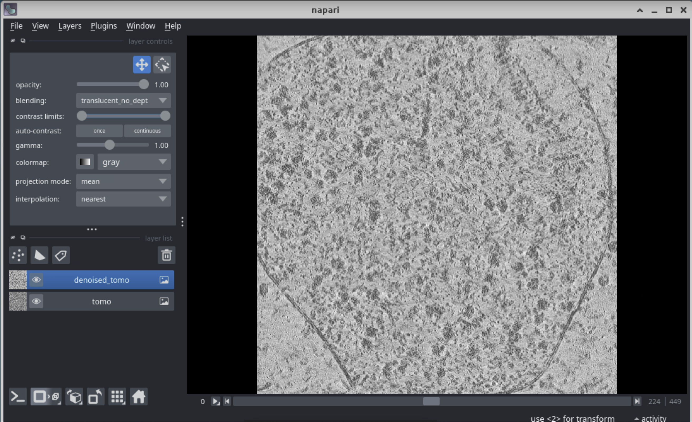
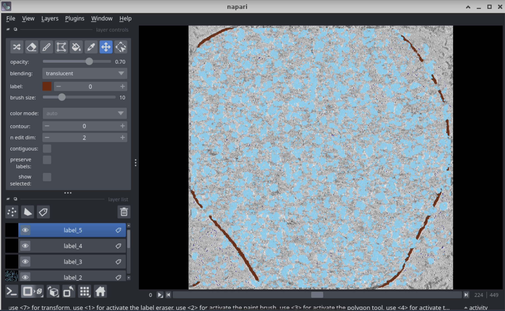
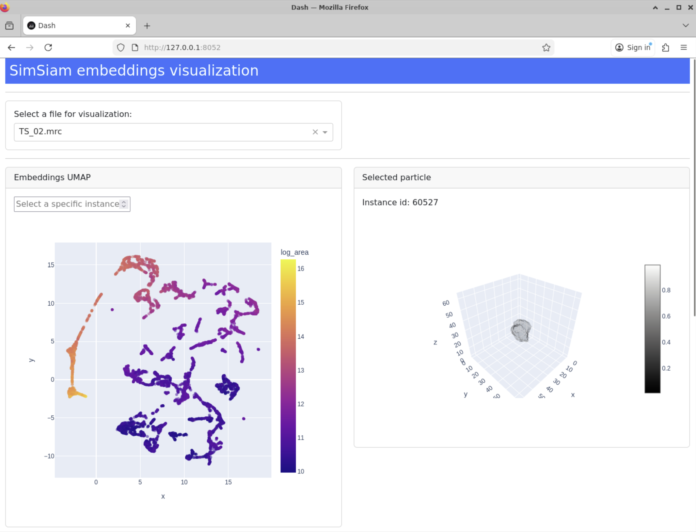
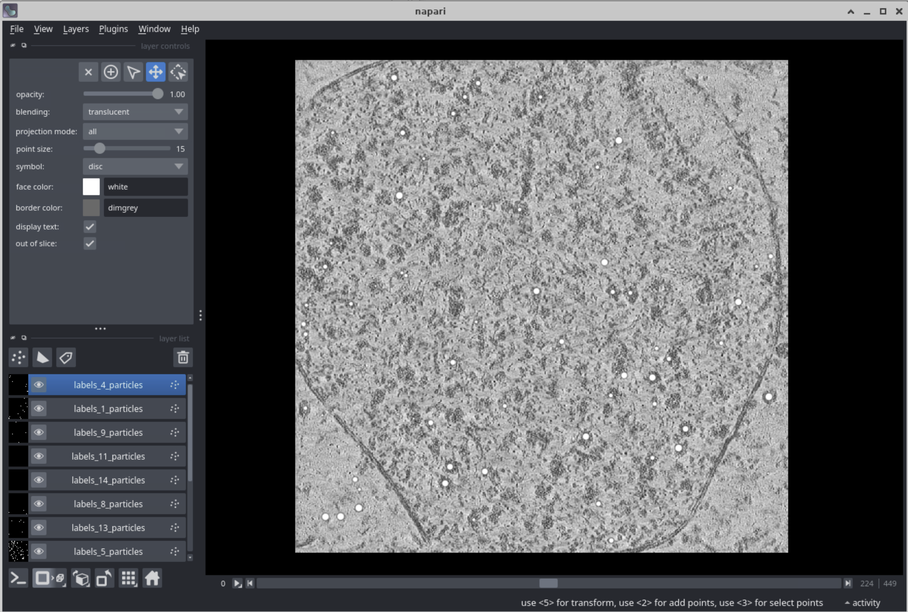

# Tutorial: End‑to‑End CryoSiam on CryoET Data Portal – **TS_02** (Dataset 10003)

This walkthrough shows how to run the full CryoSiam pipeline on **TS_02** from the CryoET Data Portal dataset **10003
** (_Mycoplasma pneumoniae_ with chloramphenicol).  
We’ll go from raw tomogram to:

- denoised tomogram
- lamella prediction
- semantic segmentation
- instance segmentation
- subtomogram embeddings
- particle identification

> **Why TS_02?** This tomogram was used to generate the examples in the figures from
> the [CryoSiam paper](https://www.biorxiv.org/content/10.1101/2025.11.11.687379).


---

## Data source

- **Dataset page:** CryoET Data Portal – *Mycoplasma pneumoniae treated with chloramphenicol*, **Deposition 10003**
    - Runs include **TS_02** reconstructed tomogram.
- You can browse and download via the [portal UI](https://cryoetdataportal.czscience.com/runs/362?table-tab=Tomograms),
  the [Python API client](https://chanzuckerberg.github.io/cryoet-data-portal/stable/python-api.html).

---

## Trained Models

The available trained models and where to download them are described here: [Trained models](trained_models.md).

---

## Prerequisites

We assume you already installed CryoSiam as shown in the [docs](installation.md), as well as CryoSiam-Vis shown
in [docs](installation_vis.md).

**Folder layout we’ll use (adjust the root path /scratch/ to your setup):**

```
/scratch/cryosiam_tutorial/
├── data/                    # raw or denoised tomograms
├── models/                  # pretrained models of CryoSiam
├── preds/                   # prediction folders
│   ├── denoised/
│   ├── lamella/
│   ├── semantic/
│   └── instance/
└── configs/                 # config files
```

---

## Step 0 - Download **TS_02**

### Option A: Portal UI

1. Open the dataset page, search for **TS_02**, click **View Tomogram**, and download the tomogram volume.
2. Save as: `/scratch/cryosiam_tutorial/data/TS_02.mrc`.

### Option B: Python API client

First, install the python cryoet_data_portal package:

```bash
pip install cryoet_data_portal
```

Then download tomogram TS_02:

```python
from cryoet_data_portal import Client, Tomogram

client = Client()

tomogram = Tomogram.get_by_id(client, 632)
tomogram.download_mrcfile()
```

---

## Step 1 - Denoising

Download the model
from [here](https://huggingface.co/frosinastojanovska/cryosiam_v1.0/blob/main/cryosiam_denoising.ckpt).

Create `configs/config_denoising.yaml` (download and adapt from [the general example](configs/config_denoising.yaml)):

```yaml
data_folder: '/scratch/cryosiam_tutorial/data'
log_dir: '/scratch/cryosiam_tutorial/'
prediction_folder: '/scratch/cryosiam_tutorial/preds/denoised'

trained_model: '/scratch/cryosiam_tutorial/models/cryosiam_denoising.ckpt'
file_extension: '.mrc'

test_files: null

save_raw_predictions: False
scale_prediction: True

parameters:
  gpu_devices: 1
  data:
    patch_size: [ 128, 128, 128 ]
    min: 0
    max: 1
    mean: 0
    std: 1
  network:
    in_channels: 1
    spatial_dims: 3

hyper_parameters:
  batch_size: 3
```

Run:

```bash
cd /scratch/cryosiam_tutorial
conda activate cryosiam
cryosiam denoise_predict --config_file=configs/config_denoising.yaml
```

Visualize with:

```bash
conda activate cryosiam_vis
cryosiam_vis visualize_denoising --config_file=configs/config_denoising.yaml  --filename TS_02.mrc
```

Output:



---

## Step 2 - Lamella Prediction

Download the model from [here](https://huggingface.co/frosinastojanovska/cryosiam_v1.0/blob/main/cryosiam_lamella.ckpt).

Create `configs/config_lamella.yaml` (download and adapt from [the general example](configs/config_lamella.yaml)):

```yaml
data_folder: '/scratch/cryosiam_tutorial/preds/denoised'
log_dir: '/scratch/TS02_tutorial/'
prediction_folder: '/scratch/TS02_tutorial/preds/lamella'

trained_model: '/scratch/cryosiam_tutorial/models/cryosiam_lamella.ckpt'
file_extension: '.mrc'

test_files: null

save_internal_files: False

parameters:
  gpu_devices: 1
  data:
    patch_size: [ 128, 128, 128 ]
    min: 0
    max: 1
    mean: 0
    std: 1
  network:
    in_channels: 1
    spatial_dims: 3
    threshold: 0.9
    postprocessing: True
    3d_postprocessing: False

hyper_parameters:
  batch_size: 2
```

Run:

```bash
conda activate cryosiam
cryosiam semantic_predict --config_file=configs/config_lamella.yaml
```

Visualize with:

```bash
conda activate cryosiam_vis
cryosiam_vis visualize_semantic --config_file=configs/config_lamella.yaml  --filename TS_02.mrc
```

Output:


---

## Step 3 - Semantic Segmentation (classes)

Download the model
from [here](https://huggingface.co/frosinastojanovska/cryosiam_v1.0/blob/main/cryosiam_semantic_segmentation.ckpt).

Create `configs/config_semantic.yaml` download and adapt from [the general example](configs/config_semantic.yaml)):

```yaml
data_folder: '/scratch/cryosiam_tutorial/preds/denoised'
mask_folder: '/scratch/cryosiam_tutorial/preds/lamella'
log_dir: '/scratch/cryosiam_tutorial/'
prediction_folder: '/scratch/cryosiam_tutorial/preds/semantic'

trained_model: '/scratch/cryosiam_tutorial/models/cryosiam_semantic_segmentation.ckpt'
file_extension: '.mrc'

test_files: null

parameters:
  gpu_devices: 1
  data:
    patch_size: [ 128, 128, 128 ]
    min: 0
    max: 1
    mean: 0
    std: 1
  network:
    in_channels: 1
    spatial_dims: 3
    threshold: 0.1
    postprocessing_sizes: [ -1, 5000, -1, -1, -1 ]

hyper_parameters:
  batch_size: 2
```

Run:

```bash
conda activate cryosiam
cryosiam semantic_predict --config_file=configs/config_semantic.yaml
cryosiam semantic_postprocessing --config_file=configs/config_semantic.yaml
```

Visualize with:

```bash
conda activate cryosiam_vis
cryosiam_vis visualize_semantic --config_file=configs/config_semantic.yaml  --filename TS_02.mrc
```

Output:



---

## Step 4 - Instance Segmentation (objects)

Download the model
from [here](https://huggingface.co/frosinastojanovska/cryosiam_v1.0/blob/main/cryosiam_instance.ckpt).

Create `configs/config_instance.yaml` download and adapt from [the general example](configs/config_instance.yaml)):

```yaml
data_folder: '/scratch/cryosiam_tutorial/preds/denoised'
mask_folder: '/scratch/cryosiam_tutorial/preds/lamella'
log_dir: '/scratch/cryosiam_tutorial/'
prediction_folder: '/scratch/cryosiam_tutorial/preds/instance'

trained_model: '/scratch/cryosiam_tutorial/models/cryosiam_instance.ckpt'
file_extension: '.mrc'

test_files: null

save_raw_predictions: False

parameters:
  gpu_devices: 1
  data:
    patch_size: [ 128, 128, 128 ]
    min: 0
    max: 1
    mean: 0
    std: 1
  network:
    in_channels: 1
    spatial_dims: 3
    threshold_foreground: 0.65
    boundary_bias: 0.8
    min_center_distance: 1
    max_center_distance: 4
    distance_type: 1   # 0 for using only predicted distances, 1 for using predicted distances + cdist from foreground, 2 for using only cdist
    postprocessing: True

hyper_parameters:
  batch_size: 3
```

Run:

```bash
conda activate cryosiam
cryosiam instance_predict --config_file=configs/config_instance.yaml
```

Visualize with:

```bash
conda activate cryosiam_vis
cryosiam_vis visualize_instance --config_file=configs/config_instance.yaml  --filename TS_02.mrc
```

Output:


---

## Step 5 - Filter and visualize instances within a mask (membrane proteins)

This step takes the predicted mask for the membrane and isolates the instances interacting with that mask

Take the config file from the previous step, and add the fields ```filtering_mask_folder```, ```filtering_mask_expand_voxels``` and ```filtering_mask_expand_labels```.
There is also support to use a mask provided as a mrc format file, and the field ```filtering_mask_folder: '.mrc'``` can be added to the config file to use that type of a mask. 

```yaml
data_folder: '/scratch/cryosiam_tutorial/preds/denoised'
mask_folder: '/scratch/cryosiam_tutorial/preds/lamella'
log_dir: '/scratch/cryosiam_tutorial/'
prediction_folder: '/scratch/cryosiam_tutorial/preds/instance'

trained_model: '/scratch/cryosiam_tutorial/models/cryosiam_instance.ckpt'
file_extension: '.mrc'


filtering_mask_folder: '/scratch/cryosiam_tutorial/preds/semantic'
filtering_mask_expand_voxels: 2
filtering_mask_labels: [1]
filtering_mask_extension: '.h5' # it can be .h5 for a mask coming from CryoSiam prediction or .mrc/.rec for any mask in mrc format

test_files: null

save_raw_predictions: False

parameters:
  gpu_devices: 1
  data:
    patch_size: [ 128, 128, 128 ]
    min: 0
    max: 1
    mean: 0
    std: 1
  network:
    in_channels: 1
    spatial_dims: 3
    threshold_foreground: 0.65
    boundary_bias: 0.8
    min_center_distance: 1
    max_center_distance: 4
    distance_type: 1   # 0 for using only predicted distances, 1 for using predicted distances + cdist from foreground, 2 for using only cdist
    postprocessing: True

hyper_parameters:
  batch_size: 10
```

Run:

```bash
conda activate cryosiam
cryosiam instance_filter --config_file=configs/config_instance.yaml
```

Visualize with:

```bash
conda activate cryosiam_vis
cryosiam_vis visualize_filtered_instance --config_file=configs/config_instance.yaml  --filename TS_02.mrc
```

Output:


---

## Step 6 - Subtomogram Embeddings

Download the model
from [here](https://huggingface.co/frosinastojanovska/cryosiam_v1.0/blob/main/simsiam_embeds_denoised_convex_hull.ckpt).

Create `configs/config_subtomo_embeddings.yaml` download and adapt from [the general example](configs/config_subtomo_embeddings.yaml)):

```yaml
data_folder: '/scratch/cryosiam_tutorial/preds/denoised'
instances_mask_folder: '/scratch/cryosiam_tutorial/preds/instance'
log_dir: '/scratch/cryosiam_tutorial/'
prediction_folder: '/scratch/cryosiam_tutorial/preds/subtomo_embeds'

trained_model: '/scratch/cryosiam_tutorial/models/simsiam_embeds_denoised_convex_hull.ckpt'
contrastive: True
file_extension: '.mrc'

test_files: null
clustering_files: null
visualization_files: null

min_particle_size: 1000  # create embeddings only to instances this much min voxels in their mask
max_particle_size: null
masking_type: 1
expand_labels: 3

clustering_kmeans:
  num_clusters: 6
  visualization: True

clustering_spectral:
  num_clusters: 6
  estimate_num_clusters: False
  visualization: True

visualization:
  prediction_folder: '/scratch/cryosiam_tutorial/preds/subtomo_embeds/vis'
  distance: 'euclidean'
  pca_components: null
  visualization_suffix: 'instance_regions.csv'
  visualize_umap: True
  3d_umap: False

parameters:
  gpu_devices: 0
  data:
    patch_size: [ 64, 64, 64 ]
    patch_overlap: null
    min: 0
    max: 1
    mean: 0
    std: 1
  network:
    spatial_dims: 3
    in_channels: 1
    dim: 1024

hyper_parameters:
  batch_size: 10
```

Run:

```bash
# Generate embeddings (TS_02 only)
cryosiam simsiam_embeddings_predict --config_file=configs/config_subtomo_embeddings.yaml --filename TS_02.mrc

# Visualize (UMAP/PCA)
cryosiam simsiam_visualize_embeddings --config_file=configs/config_subtomo_embeddings.yaml

# Optional clustering
cryosiam simsiam_embeddings_kmeans_clustering --config_file=configs/config_subtomo_embeddings.yaml
cryosiam simsiam_embeddings_spectral_clustering --config_file=configs/config_subtomo_embeddings.yaml
```

Visualize with:

```bash
conda activate cryosiam_vis
cryosiam_vis visualize_embeddings --config_file=configs/config_subtomo_embeddings.yaml
```

Output:



Visualize clusters with:

```bash
conda activate cryosiam_vis
cryosiam_vis visualize_embeddings_clusters --config_file=configs/config_subtomo_embeddings.yaml --clustering=spectral
```

Output:


---

## Step 7 - Particle identification

Download the model
from [here](https://huggingface.co/frosinastojanovska/cryosiam_v1.0/blob/main/cryosiam_semantic_myco_candidates.ckpt).

Create `configs/config_semantic_particle.yaml` download and adapt from [the general example](configs/config_semantic_particle.yaml)):

```yaml
data_folder: '/scratch/cryosiam_tutorial/preds/denoised'
mask_folder: '/scratch/cryosiam_tutorial/preds/lamella'
log_dir: '/scratch/cryosiam_tutorial/'
prediction_folder: '/scratch/cryosiam_tutorial/preds/semantic_particle'

trained_model: '/scratch/cryosiam_tutorial/models/cryosiam_semantic_myco_candidates.ckpt'
file_extension: '.mrc'

test_files: null

parameters:
  gpu_devices: 1
  data:
    patch_size: [ 128, 128, 128 ]
    min: 0
    max: 1
    mean: 0
    std: 1
  network:
    in_channels: 1
    spatial_dims: 3
    out_chanels: 14
    threshold: 0.7

hyper_parameters:
  batch_size: 2
```

Run:

```bash
conda activate cryosiam
cryosiam semantic_predict --config_file=configs/config_semantic_particle.yaml
cryosiam semantic_to_centers --config_file=configs/config_semantic_particle.yaml
```

Visualize with:

```bash
conda activate cryosiam_vis
cryosiam_vis visualize_semantic --config_file=configs/config_semantic_particle.yaml  --filename TS_02.mrc
```

Output:



---

## Troubleshooting

| Symptom                              | Fix                                                                      |
|--------------------------------------|--------------------------------------------------------------------------|
| TS_02 missing or different extension | Check the downloaded filename and set `file_extension` accordingly.      |
| GPU OOM                              | Reduce `batch_size` in the configs.                                      |

---

## Notes

- CryoSiam models are trained primarily on **lamella regions**; always gate with the lamella mask to avoid false
  positives outside the lamella.

